# Tijara Suite Architecture And Flow Diagrams

This document is the canonical visual design pack for Tijara Suite. Keep it
updated whenever deployment topology, module boundaries, user journeys, runtime
flows, or production operations change.

The diagrams use Mermaid so they remain source-controlled, open-source friendly,
and renderable in GitHub-compatible Markdown viewers.

## Diagram Index

| Diagram | Purpose |
|---|---|
| Deployment Architecture | Production SaaS and edge hardware topology |
| Local Development Deployment | Docker Compose developer topology |
| System Context | Users, external systems, and Tijara boundaries |
| Component Architecture | Runtime services and internal responsibilities |
| Odoo Module Map | Custom addon dependency and ownership map |
| Data Model UML | Core domain model relationships |
| POS Checkout User Flow | Cashier sales, B2B/B2C, discount, payment, print |
| Ecommerce Checkout User Flow | Storefront catalog, checkout, sale order, queue |
| Restaurant And Kiosk Activity | Dine-in, takeaway, pickup, delivery, queue |
| Offline POS Activity | Browser capture, replay, conflict review |
| Hardware Print Sequence | POS receipt print through bridge to device |
| Tenant Provisioning Activity | Tenant database, ingress, admin, backup, monitor |
| Analytics Pipeline | KPI collectors, snapshots, dashboards, reports |
| Release And Evidence Flow | CI, staging, evidence, sign-off, rollback |

## Deployment Architecture

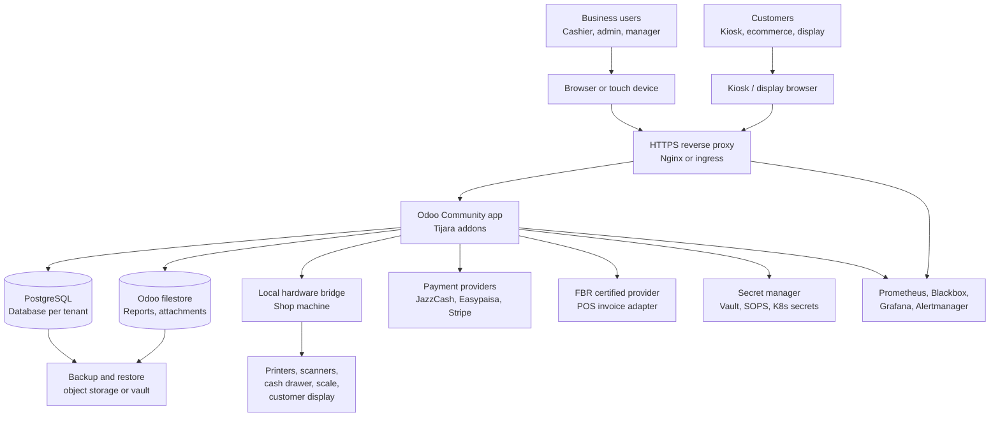

## Local Development Deployment

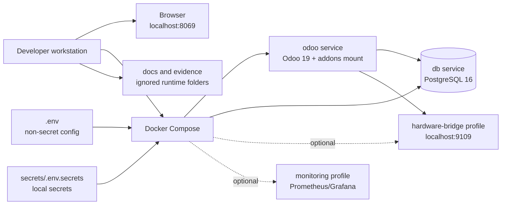

## System Context

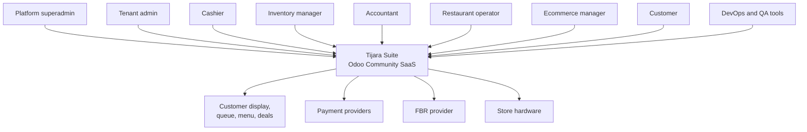

## Component Architecture

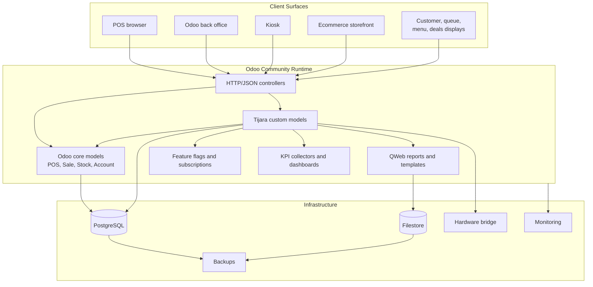

## Odoo Module Map

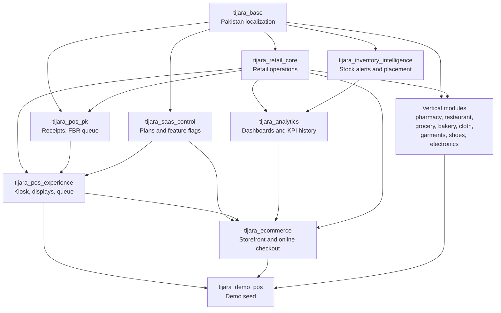

## Data Model UML

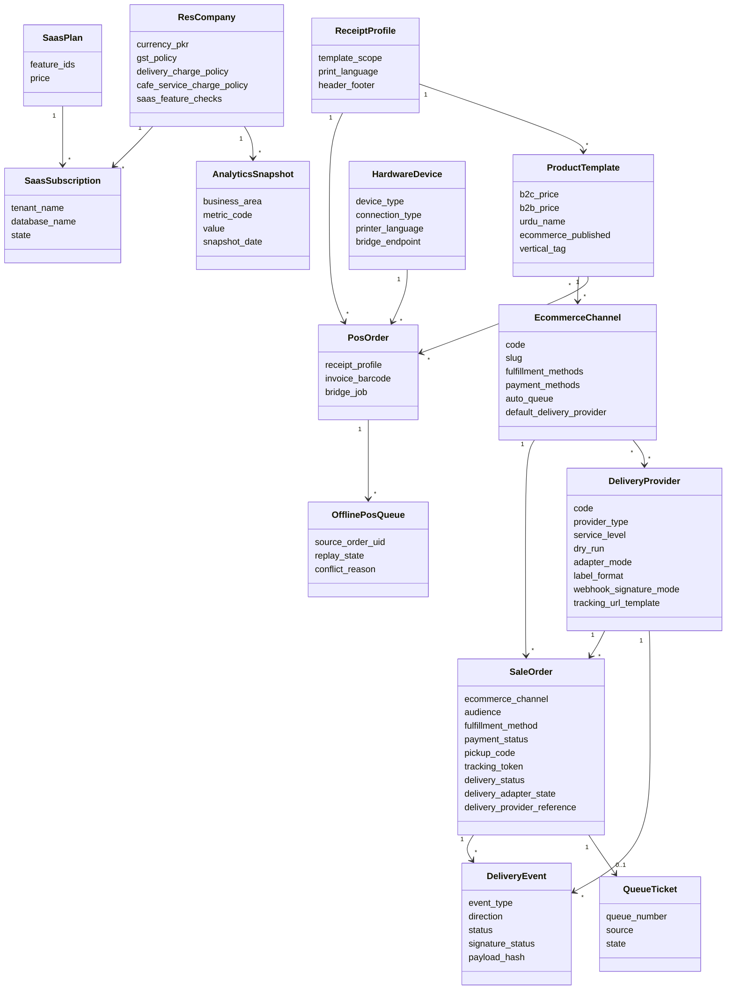

## POS Checkout User Flow

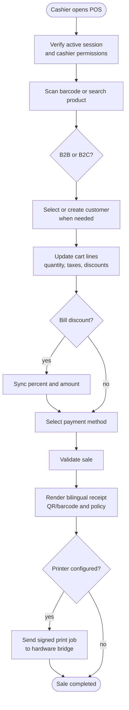

## Ecommerce Checkout User Flow

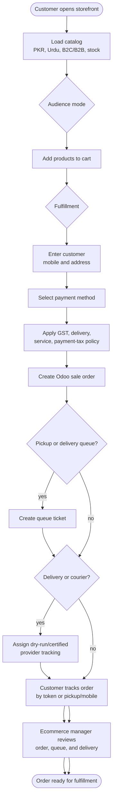

## Restaurant And Kiosk Activity

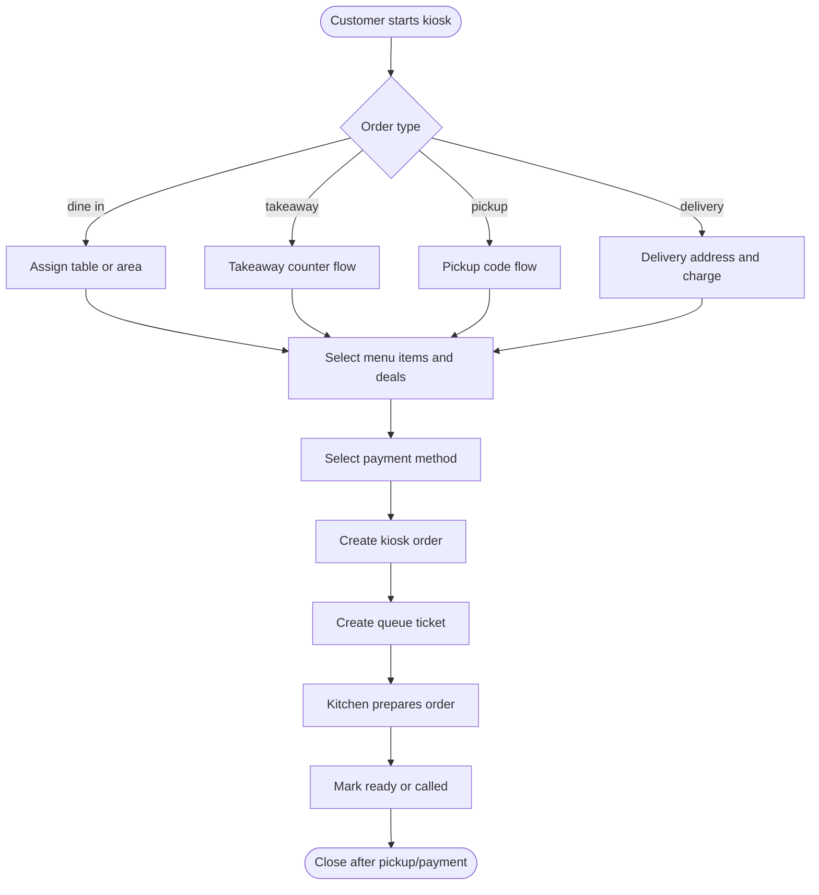

## Offline POS Activity

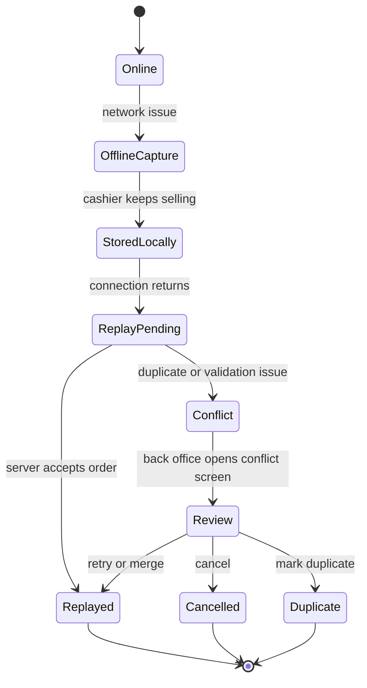

## Hardware Print Sequence

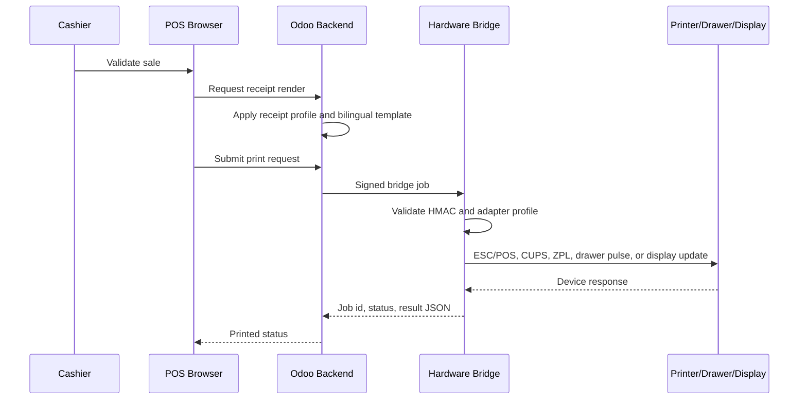

## Tenant Provisioning Activity

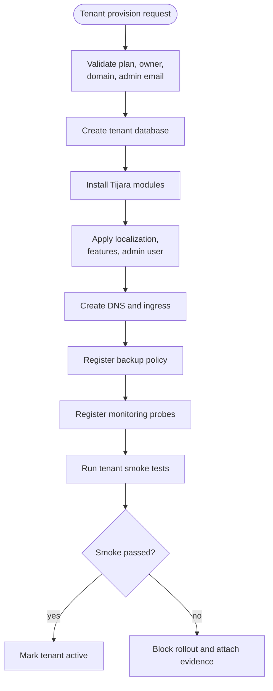

## Analytics Pipeline

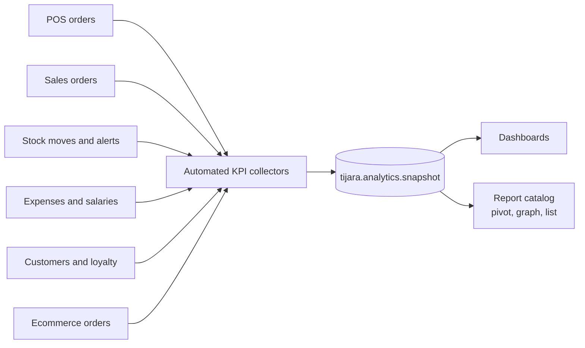

## Release And Evidence Flow

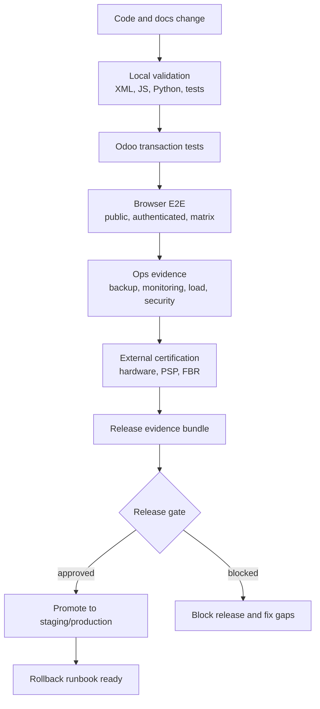

## Diagram Ownership

- Product and architecture owner: keep system, module, UML, and user-flow
  diagrams current.
- DevOps owner: keep deployment, tenant provisioning, release, monitoring,
  backup, and rollback diagrams current.
- QA owner: keep E2E, activity, and evidence diagrams aligned with test
  coverage.
- Business owner: review user flows for POS, ecommerce, restaurant, inventory,
  back office, and reporting completeness.
